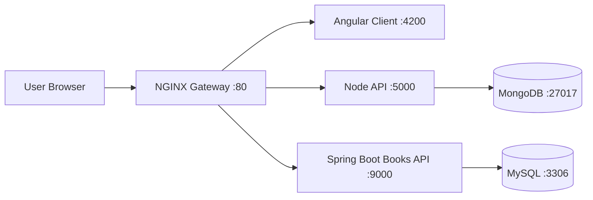

# E-MART: Microservices Deployment on Kubernetes

<p align="center">
  <strong>Multi-service e-commerce platform with Angular, Node.js, Spring Boot, Docker, Jenkins, NGINX, and Helm.</strong>
</p>

<p align="center">
  
  
  
  
  
  
</p>

<p align="center">
  <em>A full-stack storefront that combines customer shopping flows, cart and order management, authentication, and a separate books service behind one gateway.</em>
</p>

---

## Why This Project Stands Out

E-MART is not a simple monolith. It is a small platform composed of:

- An Angular storefront in [`client/`](./client)
- A Node/Express commerce API in [`nodeapi/`](./nodeapi)
- A Spring Boot books API in [`javaapi/`](./javaapi)
- An NGINX reverse proxy in [`nginx/`](./nginx)
- Docker and Docker Compose orchestration at the repository root
- A Helm chart in [`kkartchart/`](./kkartchart)
- Jenkins pipelines for image build and Kubernetes deployment

The frontend uses relative API paths (`/api`, `/webapi`), which allows the reverse proxy to present the system as a single application entrypoint.

---

## Architecture View



### Traffic Map

| Route | Target Service | Purpose |
|---|---|---|
| `/` | Angular client | Storefront UI |
| `/api/*` | Node API | Auth, products, categories, cart, orders |
| `/webapi/*` | Spring Boot API | Books CRUD endpoints |

---

## Project Evaluation

### Current Strengths

- Clear service separation between UI, commerce API, books API, gateway, and databases
- Containerized delivery across all major services
- Helm chart included for Kubernetes deployment
- Jenkins pipeline already wired for image publishing and Helm upgrades
- Frontend API usage is proxy-friendly because it relies on `/api` and `/webapi`

### Current Gaps Worth Fixing

- Secrets are hardcoded in source today, including database/JWT config and email credentials
- Runtime versions are dated: Node 14, Angular 12, Java 8, Spring Boot 2.3
- `docker-compose.yaml` has no persistent volumes, health checks, or environment externalization
- The root-level `Dockerfile` is different from the service-specific Dockerfiles and can confuse deployment intent
- There is little visible automated test coverage beyond the generated Spring Boot test and Angular defaults

### Overall Assessment

This is a solid portfolio-style DevOps/full-stack project with real deployment structure, not just CRUD screens. The biggest step to production-readiness is configuration hardening: move secrets to environment variables or secret managers, add health probes, and modernize runtime versions.

---

## Service Breakdown

| Service | Folder | Port | Stack | Backing Store |
|---|---|---:|---|---|
| Frontend | [`client/`](./client) | `4200` | Angular 12 + Bootstrap | Calls proxy routes |
| Commerce API | [`nodeapi/`](./nodeapi) | `5000` | Node.js + Express + Mongoose | MongoDB |
| Books API | [`javaapi/`](./javaapi) | `9000` | Spring Boot + Spring Data JPA | MySQL |
| Gateway | [`nginx/`](./nginx) | `80` | NGINX | Routes requests |
| Helm Chart | [`kkartchart/`](./kkartchart) | n/a | Kubernetes packaging | K8s deployment |

---

## Feature Snapshot

### Storefront

- Landing page with promotional sections and product highlights
- Login and registration flows
- Protected dashboard route for authenticated users
- Product search, filtering, and category browsing
- Cart flow and order placement
- Book module connected to the Java service

### Node Commerce API

- User registration and login with JWT-based auth
- Product CRUD with image upload support
- Category CRUD and category-linked product retrieval
- Cart management per user
- Order creation and shipping-date validation
- Current user and order history endpoints

### Spring Boot Books API

- List all books
- Search books by title
- Fetch book by ID
- Create, update, and delete books
- Fetch published books

---

## Repository Layout

```text
emartapp-main/
|-- client/                  # Angular storefront
|-- nodeapi/                 # Node/Express commerce backend
|-- javaapi/                 # Spring Boot books backend
|-- nginx/                   # Reverse proxy configuration
|-- kkartchart/              # Helm chart and K8s templates
|-- docker-compose.yaml      # Local multi-container orchestration
|-- Dockerfile               # Root multi-stage image build
|-- Jenkinsfile              # CI/CD pipeline for images + Helm
`-- intDockerAndCompose.txt  # Docker/Docker Compose setup notes
```

---

## Tech Stack

| Layer | Technologies |
|---|---|
| Frontend | Angular 12, TypeScript, Bootstrap, Font Awesome |
| Commerce Backend | Node.js, Express, Mongoose, JWT, Multer, Nodemailer |
| Books Backend | Java 8, Spring Boot 2.3, Spring Data JPA |
| Databases | MongoDB 4, MySQL 8.0.33 |
| Gateway | NGINX |
| Containers | Docker, Docker Compose |
| Delivery | Jenkins, Helm, Kubernetes |

---

## Local Development

### 1. Prerequisites

- Node.js 14.x recommended for parity with the Dockerfiles
- npm
- Java 8
- Maven
- Docker and Docker Compose

### 2. Run Services Individually

### Frontend

```bash
cd client
npm install
npm start
```

Opens the Angular app on `http://localhost:4200`.

### Node API

```bash
cd nodeapi
npm install
npm start
```

Runs the commerce API on `http://localhost:5000`.

Expected dependency:

- MongoDB available at `mongodb://emongo:27017/epoc` or adjusted in `nodeapi/config/keys.js`

### Spring Boot API

```bash
cd javaapi
mvn spring-boot:run
```

Runs the books API on `http://localhost:9000`.

Expected dependency:

- MySQL available at `emartdb:3306/books` or adjusted in `javaapi/src/main/resources/application.properties`

---

## Docker Compose Run

Use Docker Compose when you want the complete stack with gateway plus both databases.

```bash
docker compose up --build
```

Exposed services:

| URL | Description |
|---|---|
| `http://localhost/` | Main application via NGINX |
| `http://localhost:4200` | Frontend container direct access |
| `http://localhost:5000` | Node API direct access |
| `http://localhost:9000` | Spring API direct access |
| `http://localhost:27017` | MongoDB |
| `http://localhost:3306` | MySQL |

### Compose Topology

The root [`docker-compose.yaml`](./docker-compose.yaml) starts:

- `client`
- `api`
- `webapi`
- `nginx`
- `emongo`
- `emartdb`

---

## Run on AWS EC2

This project can be deployed on an EC2 Linux server with Docker Compose. The simplest path is:

1. Launch an Ubuntu EC2 instance.
2. Install Docker and Docker Compose.
3. Clone this repository onto the server.
4. Start the stack with `docker compose up --build -d`.
5. Access the app through the EC2 public IP or a domain pointed to the instance.

### Recommended EC2 Setup

- AMI: Ubuntu 22.04 LTS or Ubuntu 20.04 LTS
- Instance type: `t2.medium` or larger recommended for running all services together
- Storage: at least `20 GB`
- Security Group inbound rules:
  - `22` for SSH
  - `80` for HTTP
  - `4200` optional, only if you want direct frontend access
  - `5000` optional, only if you want direct Node API access
  - `9000` optional, only if you want direct Spring API access

For a cleaner public deployment, expose only `22` and `80`, then use NGINX as the entrypoint.

### 1. Connect to the Server

```bash
ssh -i your-key.pem ubuntu@<EC2_PUBLIC_IP>
```

### 2. Install Docker and Docker Compose

The repository already includes notes in [`intDockerAndCompose.txt`](./intDockerAndCompose.txt). On Ubuntu, the flow is:

```bash
sudo apt-get update
sudo apt-get install -y ca-certificates curl gnupg lsb-release
curl -fsSL https://download.docker.com/linux/ubuntu/gpg | sudo gpg --dearmor -o /usr/share/keyrings/docker-archive-keyring.gpg
echo "deb [arch=$(dpkg --print-architecture) signed-by=/usr/share/keyrings/docker-archive-keyring.gpg] https://download.docker.com/linux/ubuntu $(lsb_release -cs) stable" | sudo tee /etc/apt/sources.list.d/docker.list > /dev/null
sudo apt-get update
sudo apt-get install -y docker-ce docker-ce-cli containerd.io
sudo curl -L "https://github.com/docker/compose/releases/download/1.29.2/docker-compose-$(uname -s)-$(uname -m)" -o /usr/local/bin/docker-compose
sudo chmod +x /usr/local/bin/docker-compose
sudo usermod -aG docker ubuntu
newgrp docker
```

### 3. Clone the Repository

```bash
git clone https://github.com/AMANPUSHP23/E-MART-Microservices-Deployment-on-Kubernetes.git
cd E-MART-Microservices-Deployment-on-Kubernetes
```

If your extracted folder name differs, enter the folder that contains `docker-compose.yaml`.

### 4. Start the Full Stack

```bash
docker compose up --build -d
```

To verify the containers:

```bash
docker compose ps
```

To inspect logs:

```bash
docker compose logs -f
```

### 5. Open the Application

Use the EC2 public IP:

```text
http://<EC2_PUBLIC_IP>/
```

If port `80` is open in the security group and the containers are healthy, the NGINX gateway should route:

- `/` to the Angular frontend
- `/api` to the Node API
- `/webapi` to the Spring Boot API

### 6. Stop or Restart

```bash
docker compose down
docker compose up -d
```

### Optional: Run on a Domain

If you attach a domain to the EC2 public IP:

1. Create an `A` record pointing the domain to the instance IP.
2. Keep port `80` open in the security group.
3. Update NGINX config later if you want HTTPS with a reverse proxy and certificates.

### Important Server Notes

- The current project stores secrets directly in source files. Do not treat this as production-safe.
- The current Compose file does not define persistent database volumes, so container recreation can risk data loss.
- For a public server, restrict direct access to ports `5000`, `9000`, `27017`, and `3306`.
- If Docker starts after a reboot, consider enabling the service:

```bash
sudo systemctl enable docker
```

---

## Container Files

| File | Role |
|---|---|
| [`client/Dockerfile`](./client/Dockerfile) | Builds Angular and serves it through NGINX on port `4200` |
| [`nodeapi/Dockerfile`](./nodeapi/Dockerfile) | Installs and runs the Express API on port `5000` |
| [`javaapi/Dockerfile`](./javaapi/Dockerfile) | Builds the JAR with Maven and runs Spring Boot on port `9000` |
| [`Dockerfile`](./Dockerfile) | Root multi-stage build combining UI artifacts with Node runtime |

Note: the repo currently contains both service-level Dockerfiles and a root aggregate Dockerfile. If this repository evolves further, it would be worth standardizing on one deployment strategy to reduce ambiguity.

---

## Reverse Proxy Design

[`nginx/default.conf`](./nginx/default.conf) routes traffic like this:

- `/` to the Angular client
- `/api` to the Node API
- `/webapi` to the Spring Boot books API

This is why the Angular services can safely call relative endpoints such as:

- `/api`
- `/webapi`

without hardcoding hostnames into production builds.

---

## API Surface

### Node API

Base path: `/api`

Representative routes:

- `POST /api/user/register`
- `POST /api/user/login`
- `GET /api/shop/info`
- `GET /api/shop/products`
- `POST /api/shop`
- `PUT /api/shop/cart/:userId/:productId`
- `POST /api/shop/orders/:userId`
- `GET /api/shop/current`

### Books API

Base path: `/webapi`

Representative routes:

- `GET /webapi/books`
- `GET /webapi/books/{id}`
- `POST /webapi/books`
- `PUT /webapi/books/{id}`
- `DELETE /webapi/books/{id}`
- `GET /webapi/books/published`

---

## CI/CD Pipeline

The root [`Jenkinsfile`](./Jenkinsfile) shows a deployment flow with:

- Docker image builds for `client`, `javaapi`, and `nodeapi`
- Pushes to a Nexus-style registry
- Helm upgrades against the `kkartchart` chart
- Change-based stages so only modified services rebuild and redeploy

This gives the project a strong DevOps story:

- Application code
- Container packaging
- Registry publish
- Kubernetes rollout

all in the same repository.

---

## Alternative Jenkins to EKS Pipeline

This repository now also includes an alternative Jenkins pipeline in [`Jenkinsfile.eks`](./Jenkinsfile.eks) for a DockerHub to AWS EKS workflow.

Pipeline flow:

1. Clean Jenkins workspace
2. Clone the GitHub repository
3. Run SonarQube scan and wait for quality gate
4. Install dependencies for `client` and `nodeapi`
5. Run OWASP Dependency Check
6. Run Trivy filesystem scan
7. Build the root Docker image
8. Run Trivy image scan
9. Login to DockerHub and push the image
10. Deploy to EKS with Helm
11. Verify rollout status, service state, and Helm release state

Supporting files:

- [`Jenkinsfile.eks`](./Jenkinsfile.eks)
- [`sonar-project.properties`](./sonar-project.properties)
- [`kkartchart/charts/backend`](./kkartchart/charts/backend)

### What This Pipeline Deploys

This EKS pipeline deploys the root Docker image built from [`Dockerfile`](./Dockerfile) through the existing backend Helm chart. That image packages:

- Angular frontend build artifacts
- Node.js backend runtime

For this EKS path, the chart is configured to:

- deploy the `main` Node-based workload
- disable the `books` workload
- disable ingress
- expose the service as `LoadBalancer`

It does not package the separate Spring Boot service or the backing databases into the same image. If you want a full multi-service EKS deployment, the better long-term approach is to extend the existing Helm release strategy already present in [`kkartchart/`](./kkartchart).

### Jenkins Prerequisites

To run [`Jenkinsfile.eks`](./Jenkinsfile.eks), Jenkins should already have:

- NodeJS tool named `node18`
- Sonar scanner tool named `sonar-scanner`
- SonarQube server config named `mysonar`
- DockerHub credential with ID `dockerhub-creds`
- `helm`, `kubectl`, `docker`, `trivy`, and OWASP Dependency Check installed on the Jenkins agent
- kubeconfig or IAM-backed cluster access for the target AWS EKS cluster

---

## Kubernetes and Helm

The Helm chart lives in [`kkartchart/`](./kkartchart) and is organized into:

- `charts/frontend`
- `charts/backend`
- `charts/database`

Configured service paths in the chart:

- Frontend path: `/`
- Main API path: `/api`
- Books API path: `/webapi`

Typical install command:

```bash
helm upgrade kubekart kkartchart --install --namespace kart
```

---

## Recommended Hardening Roadmap

If you want to improve this codebase beyond documentation, tackle these next:

1. Move JWT, database, and SMTP secrets out of source code.
2. Add `.env` support for local development and secret references for Kubernetes.
3. Add database volumes in Compose so state survives restarts.
4. Add health checks and readiness/liveness probes.
5. Upgrade Node, Angular, Java, and Spring Boot versions.
6. Add real backend and frontend test coverage for critical flows.
7. Remove duplicated or overlapping container build strategies.

---

## Quick Start Summary

```bash
git clone <your-repo-url>
cd emartapp-main
docker compose up --build
```

Then open:

```text
http://localhost/
```

---

## Final Note

This repository already demonstrates full-stack breadth:

- UI development
- API development
- Polyglot backend architecture
- Reverse proxying
- Containerization
- CI/CD
- Helm-based Kubernetes deployment

With secret management and runtime modernization, it can move from a strong learning/demo platform toward a more production-shaped implementation.
